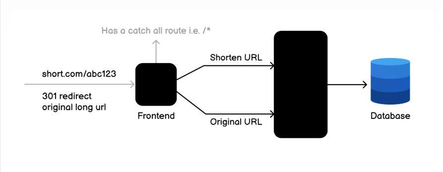

# URL Shortener API

A simple Node.js + Express + MongoDB URL shortener service.



Image source: roadmap.sh

## Overview

This API allows you to:

- Create a short code for a long URL
- Retrieve a URL entry by short code
- Update an existing short code
- Delete a URL entry
- Track access count for each short URL

## Tech Stack

- Node.js (ESM modules)
- Express
- MongoDB + Mongoose
- mongoose-type-url
- dotenv

## Project Structure

```
.
├── assets/
├── src/
│   ├── app.js
│   ├── server.js
│   ├── controllers/
│   │   └── url.controllers.js
│   ├── models/
│   │   └── url.models.js
│   └── routes/
│       └── url.routes.js
├── utils/
│   └── generator.utils.js
└── package.json
```

## Prerequisites

- Node.js 20+
- MongoDB connection string

## Installation

1. Install dependencies:

   npm install

2. Create an environment file in the project root:

   .env

3. Add the required variables:

   PORT=3000
   MONGO_URI=your_mongodb_connection_string
   APP_ENV=development

## Run

Start the server:

npm start

Expected startup logs:

- db connected succesfully
- server running on port 3000

## API Endpoints

Base prefix: /api

### 1) Create Short URL

- Method: POST
- Path: /api/create-url
- Body:

  {
  "longUrl": "https://example.com/some/very/long/path"
  }

- Success response: 201

### 2) Update Short Code

- Method: PUT
- Path currently registered: /api/update-url-code
- Controller expects: req.params.shortCode

Recommended route shape:

- /api/update-url-code/:shortCode

### 3) Get URL By Short Code

- Method: GET
- Path currently registered: /api/get-url
- Controller expects: req.params.shortCode

Recommended route shape:

- /api/get-url/:shortCode

### 4) Delete URL By Short Code

- Method: DELETE
- Path currently registered: /api/delete-url
- Controller expects: req.params.shortCode

Recommended route shape:

- /api/delete-url/:shortCode

## Data Model

Collection: Url

- longUrl: URL, required
- shortCode: String (length 4), unique
- accessCount: Number, default 0
- createdAt / updatedAt: timestamps

## Error Handling

Global error middleware in src/app.js handles:

- Validation errors (400)
- Duplicate key errors (409)
- JWT errors (401)
- Fallback internal errors (500)

## Known Issues To Fix

1. Route params mismatch:

   update/get/delete handlers read req.params.shortCode, but routes are currently defined without :shortCode.

2. Relative import path to generator utility:

   Because utils is outside src, imports from src/models and src/controllers should reference ../../utils/generator.utils.js.

## Quick Test With curl

Create:

curl -X POST http://localhost:3000/api/create-url \
 -H "Content-Type: application/json" \
 -d '{"longUrl":"https://example.com"}'

Get (after updating route to include :shortCode):

curl http://localhost:3000/api/get-url/abcd
